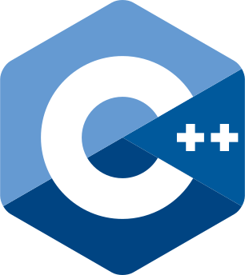
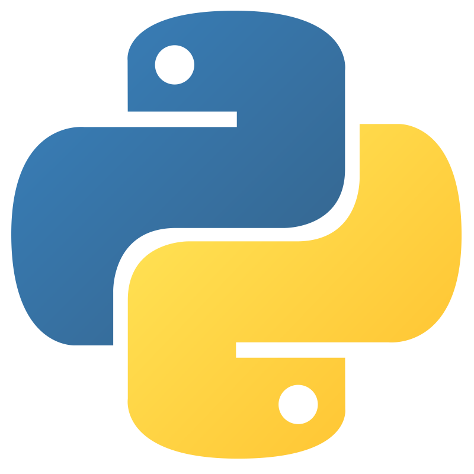
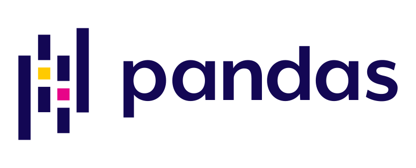

---
# Hi there 👋
— 🌱 I’m currently learning in Moscow State University

---
# 🔭 Programming Skills & Related
* Languages: Python, C++, SQL
* Technologies: 
(Python) jupyter, pandas, numpy, matplotlib, sklearn, pytorch, tensorflow;
(DevOps) Docker, k8s, git, Linux/Bash, LaTeX
(robots) ROS, gazebo

  
  
  
  

  
  

   
   
  
   
  
   
   

  
  
  
  
  
  

  
  

<!--
**pikachoostark/pikachoostark** is a ✨ _special_ ✨ repository because its `README.md` (this file) appears on your GitHub profile.

Here are some ideas to get you started:

- 🔭 I’m currently working on ...

- 👯 I’m looking to collaborate on ...
- 🤔 I’m looking for help with ...
- 💬 Ask me about ...
- 📫 How to reach me: ...
- 😄 Pronouns: ...
- ⚡ Fun fact: ...
-->
